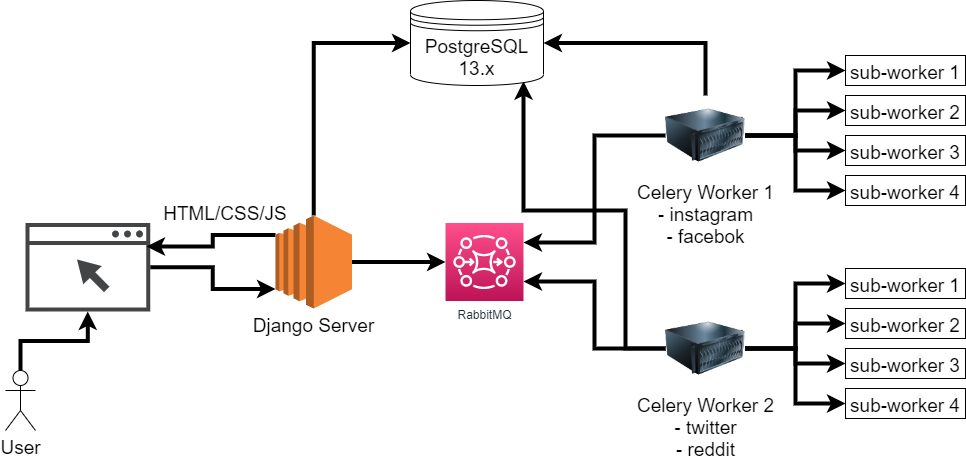
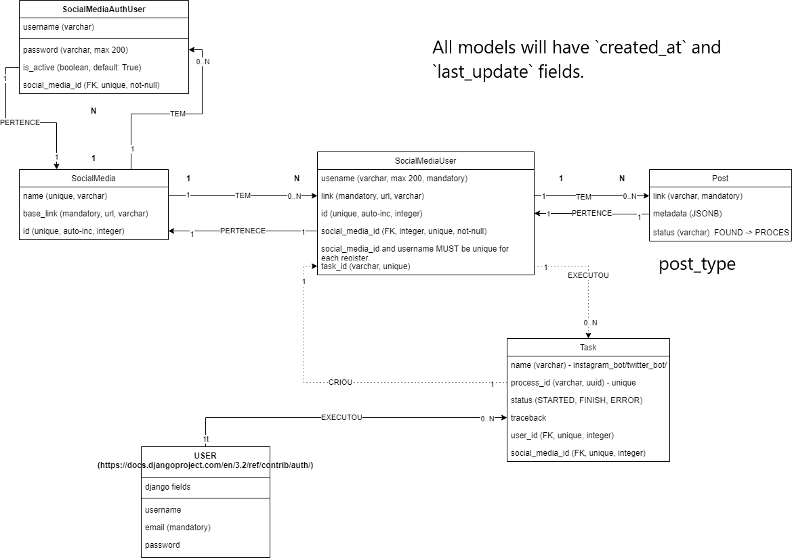

# Social Scrapper Portal

This document will explain the `Social Scrapper Portal` a.k.a SSP.

The SSP is an educational project to learn and practice more Django, Celery, Selenium, WEB Development, and a little of Infrastructure, we go from implementation to deploy, for deploy our project we will use `AWS`. 

## "Business" Overview

SSP is a Web-based portal for get, access, and analyze Social Media Information (a.k.a SMI) of accounts on:

* Twitter.
* Facebook.
* Instagram.
* Reddit (Pages).

*Social Media Information* means posts and public stats from them (likes, retweets, # comments, etc.).

***DISCLAMER: This project is only educational, we can't use it like real business due to the way how we will get the Social Media Information.***

## User Use Cases

below a list of use cases available for users.

- A user could sign-up and sign in on SSP.
- A user could recovery his password.
- A user can request the Social Media Information for one username in a specific Social Media.
  - Request the *SMI* of an username in multiples Social Media.
  - Request the *SMI* of many usernames in a Social Media.
  - Request the SMI of many usernames in multiples Social Media.
- A user can search the *SMI* process requested.
- A user can track the *SMI* extraction process progress.
  - See process logs.
  - See progress %.
- A user can cancel/pause the *SMI* Extraction process.
  - Data is not erase.
- A user can see the unfinished/finished *SMI* data of an username and Social Media
- A user can export a report with the *SMI* data for an username and Social Media.

## Technical Details

### Architecture overview

We will develop a regular web application (HTML/CSS/JS send by the backend server) with [Django](https://www.djangoproject.com/) and for asynchronous tasks, we will user [Celery](https://docs.celeryproject.org/en/stable/index.html) with [RabbitMQ](https://www.cloudamqp.com/docs/index.html) like message broker.

and use a [PostgreSQL](https://postgresql.org/) for store persistent data.

## Design

Below is a PDF with the App screens, it's only one reference not necessary that will have the same styles.

 [SSP V0.0.2.pdf](./docs/SSP V0.0.2.pdf) 

### Database Schema

Below is the first database schema version

## Docs

* [GIT Flow](./docs/git_flow.md)

